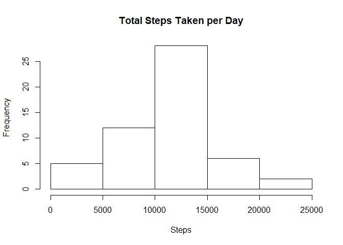
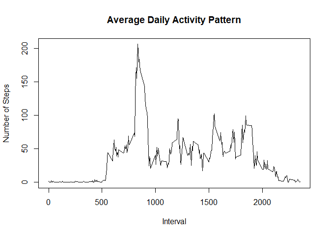
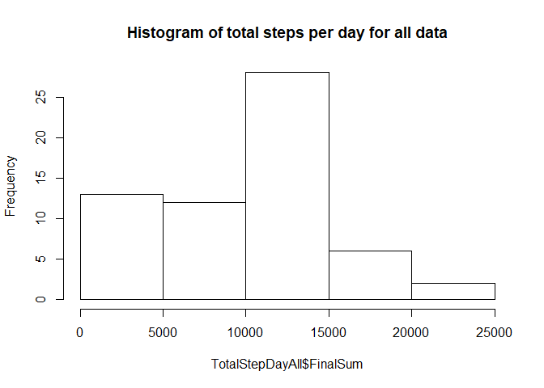
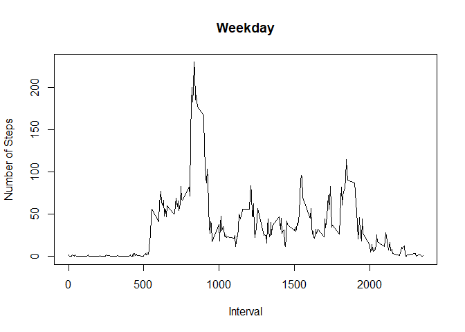
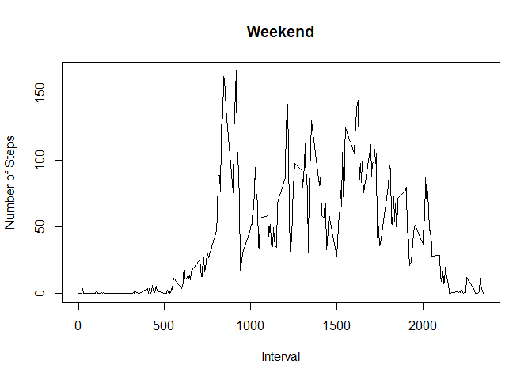

## Loading and preprocessing the data

```r
knitr::opts_chunk$set(echo = TRUE)

#Libraries

library(lubridate)
```

```
## 
## Attaching package: 'lubridate'
```

```
## The following object is masked from 'package:base':
## 
##     date
```

```r
library(dplyr)
```

```
## 
## Attaching package: 'dplyr'
```

```
## The following objects are masked from 'package:lubridate':
## 
##     intersect, setdiff, union
```

```
## The following objects are masked from 'package:stats':
## 
##     filter, lag
```

```
## The following objects are masked from 'package:base':
## 
##     intersect, setdiff, setequal, union
```

```r
#Get file

Mydata <- read.csv("C:/Users/smoro/OneDrive/Desktop/Data Science/John Hopkins University/Reproducible Research/Project_One/activity.csv", header = TRUE)

#Create weekday fields
MydataComplete <- Mydata %>% mutate (weekday = weekdays(as.Date(Mydata$date))) %>% mutate(weekdayNum = wday(Mydata$date))


#Create data set without misssing values and with missing values
WithOut <-  na.exclude(MydataComplete)
With <- MydataComplete
```


## What is mean total number of steps taken per day?

```r
#Count total steps per day
ts <- tapply(WithOut$steps, WithOut$date , sum, na.rm=T)
TotalStepDay <- data.frame(date = names(ts), sum = ts)

original <- na.exclude(TotalStepDay)
```


```r
#Histogram of total steps per day
hist(original$sum, main = "Total Steps Taken per Day", xlab = "Steps")
```

<!-- -->

```r
#Mean number of steps per Day
mean(original$sum)
```

```
## [1] 10766.19
```

```r
#Median number of steps per Day
median(original$sum)
```

```
## [1] 10765
```


## What is the average daily activity pattern?

```r
IntervalDailyPaterns <- tapply(WithOut$steps, WithOut$interval, mean)

plot(IntervalDailyPaterns ~ unique(WithOut$interval), type="l", xlab = "Interval", ylab = "Number of Steps", main = "Average Daily Activity Pattern")
```

<!-- -->

```r
#Which 5 minute interval, on average, contains maximum number of steps
IntervalDailyPaterns[which.max(IntervalDailyPaterns)]
```

```
##      835 
## 206.1698
```


## Imputing missing values


```r
#What is the total number of rows with missing values?
sum(is.na(With$steps))
```

```
## [1] 2304
```

```r
#Calculate mean per interval of steps. This will be used for NA steps
MeanIntervalNoNA <- tapply(WithOut$steps, WithOut$interval , mean)

CorrectedStep <- data.frame(interval = names(MeanIntervalNoNA), IntervalMean = round(MeanIntervalNoNA))

NeedsFixing <-With %>% filter(is.na(With$steps))

stageFix <- merge(NeedsFixing, CorrectedStep, by = "interval")

corrected <- data.frame(steps = stageFix$IntervalMean,
date = stageFix$date, interval = stageFix$interval, weekday = stageFix$weekday, weekdayNum = stageFix$weekdayNum)

Fixed <- rbind(corrected, WithOut)
```


```r
FixedSum <- tapply(Fixed$steps, Fixed$date , sum)
FixedTotalStepDay <- data.frame(date = names(FixedSum), sum = FixedSum)


hist(FixedTotalStepDay$sum, main = "Histogram of total steps per day for Fixed Data")
```

<!-- -->

```r
#Mean number of steps per Day without NA Data
mean(FixedTotalStepDay$sum)
```

```
## [1] 10765.64
```

```r
#Mean number of steps per Day with NA fix
mean(original$sum)
```

```
## [1] 10766.19
```

```r
#Median number of steps per Day without NA Data
median(FixedTotalStepDay$sum)
```

```
## [1] 10762
```

```r
#Median number of steps per Day with NA fix
median(original$sum)
```

```
## [1] 10765
```

```r
#Fixed data
summary(FixedTotalStepDay$sum)
```

```
##    Min. 1st Qu.  Median    Mean 3rd Qu.    Max. 
##      41    9819   10762   10766   12811   21194
```

```r
#Original data
summary(original$sum)
```

```
##    Min. 1st Qu.  Median    Mean 3rd Qu.    Max. 
##      41    8841   10765   10766   13294   21194
```


## Are there differences in activity patterns between weekdays and weekends?


```r
Wkdays <- c("Monday","Tuesday","Wednesday","Thursday","Friday")

weekendText <- c("weekend")
weekdayText <- c("weekday")

wkDayEnd <- Fixed %>% mutate(weekType = ifelse(Fixed$weekday %in% (Wkdays),weekdayText,weekendText))


weekDayData <- wkDayEnd %>% filter(wkDayEnd$weekType == weekdayText)

weekEndData <- wkDayEnd %>% filter(wkDayEnd$weekType == weekendText)

IntervalMeanWeekDay <- tapply(weekDayData$steps, weekDayData$interval, mean)

IntervalMeanWeekEnd <- tapply(weekEndData$steps, weekEndData$interval, mean)

plot(IntervalMeanWeekDay ~ unique(wkDayEnd$interval), type="l", xlab = "Interval", ylab = "Number of Steps", main = "Weekday")
```

<!-- -->

```r
plot(IntervalMeanWeekEnd ~ unique(wkDayEnd$interval), type="l", xlab = "Interval", ylab = "Number of Steps", main = "Weekend")
```

<!-- -->

