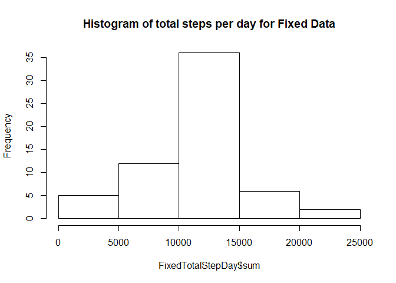

## Loading and preprocessing the data

```r
knitr::opts_chunk$set(echo = TRUE)

#Libraries

library(lubridate)
```

```
## 
## Attaching package: 'lubridate'
```

```
## The following object is masked from 'package:base':
## 
##     date
```

```r
library(dplyr)
```

```
## 
## Attaching package: 'dplyr'
```

```
## The following objects are masked from 'package:lubridate':
## 
##     intersect, setdiff, union
```

```
## The following objects are masked from 'package:stats':
## 
##     filter, lag
```

```
## The following objects are masked from 'package:base':
## 
##     intersect, setdiff, setequal, union
```

```r
#Get file

Mydata <- read.csv("C:/Users/smoro/OneDrive/Desktop/Data Science/John Hopkins University/Reproducible Research/Project_One/activity.csv", header = TRUE)

#Create weekday fields
MydataComplete <- Mydata %>% mutate (weekday = weekdays(as.Date(Mydata$date))) %>% mutate(weekdayNum = wday(Mydata$date))


#Create data set without misssing values and with missing values

WithOut <-  na.exclude(MydataComplete)
With <- MydataComplete
```


## What is mean total number of steps taken per day?

```r
#Count total steps per day
ts <- tapply(WithOut$steps, WithOut$date , sum)
TotalStepDay <- data.frame(date = names(ts), sum = ts)
```


```r
#Histogram of total steps per day
hist(TotalStepDay$sum, main = "Total Steps Taken per Day", xlab = "Steps")
```

<!-- -->


## What is the average daily activity pattern?

```r
#Mean total steps per day
m1 <- tapply(WithOut$steps, WithOut$date , mean)
MeanStepDay <- data.frame(date = names(m1), DateMean = m1)
preMedianStepDay <- WithOut %>% filter(WithOut$steps > 0)


#Median total steps per day
md <- tapply(preMedianStepDay$steps, preMedianStepDay$date , median)
MedianStepDay <- data.frame(date = names(md), DateMedian = md)
```

```r
#Create plot of mean steps per day
plot(MeanStepDay$date,MeanStepDay$DateMean, type = "l", xlab = "Date", ylab = "Mean", main = "Mean steps per Day")
#Add lines
lines(MeanStepDay$date,MeanStepDay$DateMean, type = "l")
```

<!-- -->


```r
#Create plot of median steps per day
plot(MedianStepDay$date,MedianStepDay$DateMedian, type = "l", xlab = "Date", ylab = "Median", main = "Median steps per Day")
#Add lines
lines(MedianStepDay$date,MedianStepDay$DateMedian, type = "l")
```

<!-- -->
k

```r
#That is the average daily activity pattern?
#Saturday has the highest step average than the rest of the wee
FiveInterval <- WithOut  %>% mutate(FiveInterval = ((steps / interval) * 1.0) * 5)
m2 <- tapply(FiveInterval$steps, FiveInterval$weekdayNum,  mean)
MeanWeekDays <- data.frame(day = names(m2), mean = m2)
```

## Imputing missing values


```r
#What is the total number of rows with missing values?
sum(is.na(With$steps))
```

```
## [1] 2304
```

```r
#Calculate mean and median per interval of steps. This will be used for days with NA for steps
#Date could not be used for NA data since no step data for them.
#produce mean average
m3 <- tapply(WithOut$steps, WithOut$interval , mean)
MeanStepInterval <- data.frame(interval = names(m3), IntervalMean = m3)

#produce median average
m4 <- tapply(WithOut$steps, WithOut$interval , median) 
MedianStepInterval <- data.frame(interval = names(m4), IntervalMedian = m4)


#Calculate Final Mean average for each day
CombinedFile <- merge(With, MeanStepInterval, by = "interval")
CombinedFile <- merge(CombinedFile, MeanStepDay, by = "date")
CombinedFile <- mutate(CombinedFile, FinalMean = ifelse(is.na(CombinedFile$DateMean), 
            CombinedFile$IntervalMean, CombinedFile$DateMean))

#Calculate Final Median average for each day
CombinedFile <- merge(CombinedFile, MedianStepInterval, by = "interval")
CombinedFile <- merge(CombinedFile, MedianStepDay, by = "date")
CombinedFile <- mutate(CombinedFile, FinalMedian = ifelse(is.na(CombinedFile$DateMedian), 
            CombinedFile$IntervalMedian, CombinedFile$DateMedian))

#Count total steps per day
ts2 <- tapply(With$steps, With$date , sum)

TotalStepDayAll <- data.frame(date = names(ts2), sum = ts2)

TotalStepDayAll<- mutate(TotalStepDayAll, FinalSum = ifelse(is.na(TotalStepDayAll$sum), 
            0, TotalStepDayAll$sum))
```


```r
##The frequency of total steps per day with NA data that was imputed shows more frequency counts in 0 - 5000 step range than before. The rest of buckets are identical.
#Histogram of total steps per day
hist(TotalStepDayAll$FinalSum, main = "Histogram of total steps per day for all data")
```

<!-- -->

```r
hist(TotalStepDay$sum, main = "Histogram of total steps per day for only complete data")
```

<!-- -->


## Are there differences in activity patterns between weekdays and weekends?


```r
#CombinedFile

#Create weekend subset 
SatSun <- c("Saturday", "Sunday")
weekend <- subset(CombinedFile, weekday %in% (SatSun))

#Create weekday subset
Wkdays <- c("Monday","Tuesday","Wednesday","Thursday","Friday")
weekdays <- subset(CombinedFile, weekday %in% (Wkdays))
```


```r
#Get the 5 minute interval mean for NA rows
naSet <- CombinedFile[is.na(CombinedFile$steps),] %>% select(steps,date,interval, weekday, weekdayNum, FinalMean)
#naFiveInterval <- subset(naSet, interval == 5)

#Calculate five minute interal for NA file
naFiveInterval <- naSet  %>% mutate(FiveInterval = ((FinalMean / interval) * 1.0) * 5) %>% select(steps,date,interval, weekday, weekdayNum, FiveInterval)

#Combine the two five interval files into one
CombinedFiveInterval <- rbind(FiveInterval, naFiveInterval)

CombinedFiveIntervalFinal  <- na.exclude(CombinedFiveInterval) 
CombinedFiveIntervalFinal <- subset(CombinedFiveIntervalFinal, interval > 0 )


#Create weekday subset
Wkdays <- c("Monday","Tuesday","Wednesday","Thursday","Friday")
weekdays <- subset(CombinedFiveIntervalFinal, weekday %in% (Wkdays))

w1 <- tapply(weekdays$steps, weekdays$weekdayNum,  mean)

weekdayAverage <- data.frame(day = names(w1), mean = w1)

#Create weekend subset 
SatSun <- c("Saturday", "Sunday")
weekend <- subset(CombinedFiveIntervalFinal, weekday %in% (SatSun))

w2 <- tapply(weekend$steps, weekend$weekdayNum,  mean)

weekendAverage <- data.frame(day = names(w2), mean = w2)

#Display time series of average steps for week days and then weekend days
par(mfrow=c(1,2))

plot(weekdayAverage$mean, weekdayAverage$day, type = "l", xlab = "Average Steps per Day", ylab = "Day of Week", main = "Weekday average steps all data")


plot(weekendAverage$mean, weekendAverage$day, type = "l", xlab = "Average Steps per Day", ylab = "Day of Week", main = "Weekend average steps all data")
```

<!-- -->

